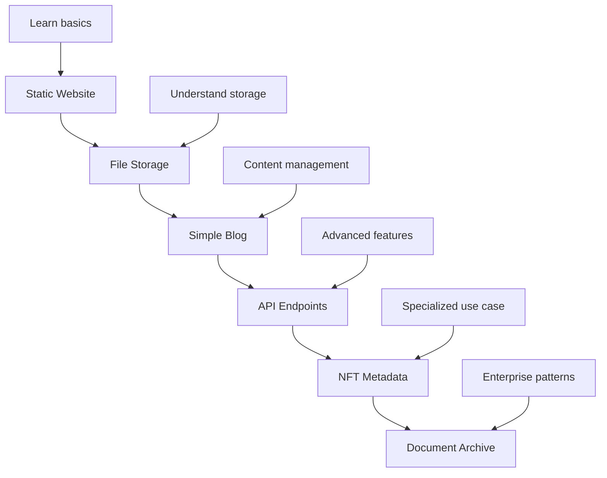

# WTTP Working Code Examples

> **🎯 Complete, tested code examples for real-world WTTP applications**

## 📁 Directory Structure

```
docs/examples/
├── static-website/     # Deploy a complete static website
├── simple-blog/        # Create and manage a blog with posts
├── file-storage/       # Upload, download, and manage files
├── api-endpoints/      # Create RESTful API endpoints
├── nft-metadata/       # Store NFT metadata permanently
└── document-archive/   # Create permanent document storage
```

## 🚀 Getting Started

**Prerequisites:** Before using these examples, complete the [blockchain basics setup](../user-guide/blockchain-basics.md):

- ✅ MetaMask wallet configured
- ✅ Sepolia testnet added and funded
- ✅ Private key security understood
- ✅ Development environment prepared

## 📋 Example Categories

### 🌐 Web Hosting Examples

| **Example** | **Description** | **Difficulty** | **Est. Time** |
|-------------|-----------------|----------------|---------------|
| [Static Website](./static-website/) | Deploy HTML/CSS/JS website | Beginner | 20 minutes |
| [Simple Blog](./simple-blog/) | Create blog with post management | Intermediate | 45 minutes |
| [API Endpoints](./api-endpoints/) | RESTful API with CORS setup | Advanced | 60 minutes |

### 💾 Storage Examples

| **Example** | **Description** | **Difficulty** | **Est. Time** |
|-------------|-----------------|----------------|---------------|
| [File Storage](./file-storage/) | Upload/download file management | Beginner | 30 minutes |
| [Document Archive](./document-archive/) | Permanent document storage | Intermediate | 40 minutes |
| [NFT Metadata](./nft-metadata/) | Store NFT metadata permanently | Advanced | 50 minutes |

## 🛠️ Usage Instructions

Each example includes:

- **📖 Complete README** with step-by-step instructions
- **💻 Working code** that you can run immediately
- **📋 Prerequisites** and requirements
- **⚡ Quick start** commands
- **🔧 Customization** options
- **🚨 Troubleshooting** common issues

### Quick Start Process

1. **Choose your example** from the categories above
2. **Read the README** in that directory
3. **Copy the example** to your local development environment
4. **Update configuration** with your settings
5. **Run the deployment** scripts
6. **Test your WTTP site** functionality

## 💡 Example Selection Guide

### New to WTTP?
Start with **Static Website** - it's the simplest way to understand WTTP basics.

### Want to Build a Blog?
Try **Simple Blog** - shows content management and permissions.

### Need File Storage?
Use **File Storage** - demonstrates upload/download workflows.

### Building NFT Projects?
Check **NFT Metadata** - permanent metadata storage patterns.

### Creating APIs?
Explore **API Endpoints** - RESTful services on blockchain.

### Archiving Documents?
Try **Document Archive** - permanent, verifiable storage.

## 🔗 Integration with Sam's Infrastructure

**Current Status**: Sam is fixing critical deployment infrastructure bugs. Once his improvements are complete, all examples will be thoroughly tested and validated.

**Coming Soon**:
- ✅ Validated deployment scripts
- ✅ Infrastructure reliability improvements
- ✅ Enhanced error handling
- ✅ Performance optimizations

## 📚 Learning Path

**Recommended progression:**



## 🆘 Getting Help

**If you encounter issues:**

1. **Check troubleshooting** section in each example's README
2. **Review blockchain basics** - most issues are wallet/testnet related
3. **Verify prerequisites** - ensure all setup steps completed
4. **Check example-specific** requirements and dependencies

## 🚀 Ready to Start?

Choose your first example and dive in! Each example is designed to work independently while building on concepts from previous examples.

**Most Popular Starting Points:**
- 🌐 [Static Website](./static-website/) - Perfect for beginners
- 💾 [File Storage](./file-storage/) - Great for understanding WTTP storage
- 📝 [Simple Blog](./simple-blog/) - Best for content creators

---

> **💡 Pro Tip**: All examples use testnet ETH, so you can experiment freely without any real costs! 