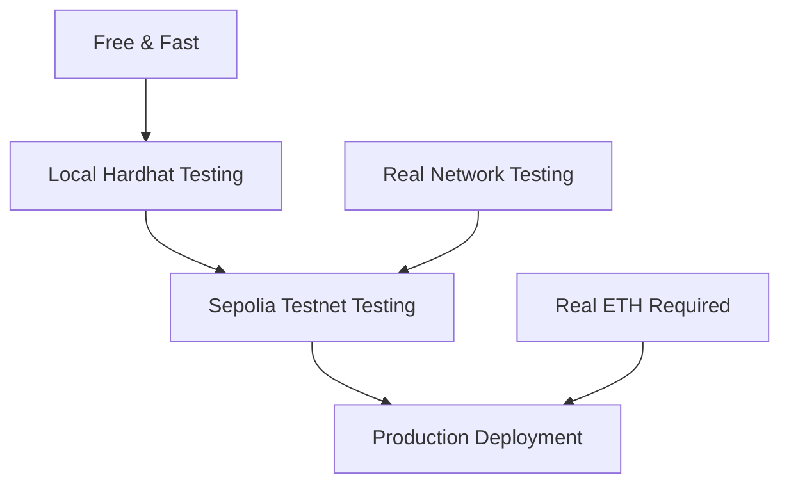

<!--
© 2025 TechnicallyWeb3 – Licensed under AGPL-3.0
-->

# Blockchain Basics for Web Developers

> **🎯 Target Audience**: Web developers familiar with traditional APIs who are new to blockchain development

## 🚨 CRITICAL: Understanding Private Key Security

### The Fundamental Difference: API Keys vs Private Keys

If you're coming from traditional web development, **this is the most important concept to understand**:

| **Traditional API Keys** | **Blockchain Private Keys** |
|--------------------------|------------------------------|
| ✅ Can be regenerated if compromised | ❌ **CANNOT be regenerated** |
| ✅ Limited scope and permissions | ❌ **Full access to all funds** |
| ✅ Centrally managed | ❌ **Your responsibility only** |
| ⚠️ Exposure = service disruption | 🚨 **Exposure = permanent fund loss** |

### 🔒 Private Key Security Rules

**NEVER:**
- Commit private keys to version control
- Store private keys in plain text files
- Share private keys in chat/email
- Use mainnet private keys in development
- Store private keys in browser localStorage

**ALWAYS:**
- Use environment variables (.env files)
- Use different keys for development/production
- Write down seed phrases on paper (not digital)
- Store recovery phrases in multiple secure physical locations
- Use hardware wallets for production/mainnet

## 💳 Setting Up Your Development Wallet

### Step 1: Install MetaMask

1. Go to [metamask.io](https://metamask.io) and install the browser extension
2. Create a new wallet (write down your seed phrase on paper!)
3. **Important**: This will be your **development wallet only**

### Step 2: Environment Variable Setup

Create a `.env` file in your project root:

```bash
# .env file - NEVER commit this to version control!
PRIVATE_KEY=your_development_private_key_here
SEPOLIA_RPC_URL=https://sepolia.infura.io/v3/your_infura_key
```

Add to your `.gitignore`:
```
.env
.env.local
.env.development
.env.production
```

### Step 3: Get Your Private Key

**For Development Only:**
1. Open MetaMask
2. Click account menu → Account details
3. Click "Export Private Key"
4. Enter your password
5. **Copy private key to .env file only**

⚠️ **Remember**: This private key should only be used for development with testnet funds!

## 🧪 Understanding Testnets

### What Are Testnets?

Think of testnets as "staging environments" for blockchain:

- **Free "fake" cryptocurrency** for testing
- **Identical functionality** to mainnet
- **Safe environment** for development
- **No real value** - perfect for learning

### Sepolia Testnet (Recommended)

Sepolia is Ethereum's primary testing network:

**Network Details:**
- **Network Name**: Sepolia Testnet
- **RPC URL**: `https://sepolia.infura.io/v3/YOUR_KEY`
- **Chain ID**: 11155111
- **Currency Symbol**: SepoliaETH
- **Block Explorer**: https://sepolia.etherscan.io

### Adding Sepolia to MetaMask

1. Open MetaMask
2. Click network dropdown (usually shows "Ethereum Mainnet")
3. Click "Add Network" → "Add a network manually"
4. Enter the network details above
5. Click "Save"

### Getting Testnet ETH

You need testnet ETH to pay for transactions:

**Sepolia Faucets** (free testnet ETH):
- [Alchemy Sepolia Faucet](https://sepoliafaucet.com/)
- [Infura Sepolia Faucet](https://www.infura.io/faucet/sepolia)
- [Chainlink Sepolia Faucet](https://faucets.chain.link/sepolia)

**Steps:**
1. Switch MetaMask to Sepolia network
2. Copy your wallet address
3. Visit a faucet and paste your address
4. Wait 1-2 minutes for ETH to arrive
5. Verify balance in MetaMask

### Local Hardhat Network

For development, Hardhat provides a local blockchain:

```bash
npx hardhat node
```

**Benefits:**
- 🎁 **10,000 ETH automatically provided**
- ⚡ **Instant transactions**
- 🌐 **No internet required**
- 🔄 **Perfect for rapid testing**

## ⛽ Understanding Gas and Transactions

### What is Gas?

Think of gas as the "postage stamp" for blockchain transactions:

- **Gas = Computational Work** measurement
- **Higher Gas = Faster Processing**
- **Every Operation Costs Gas**

### Gas in Traditional Terms

| **Traditional Web** | **Blockchain Equivalent** |
|---------------------|---------------------------|
| Server processing time | Gas units consumed |
| Hosting costs | Gas fees paid |
| API rate limits | Gas limits per block |
| Server capacity | Network throughput |

### WTTP Gas Cost Examples

**Typical Operations** (on Sepolia testnet):

| **Operation** | **Gas Cost** | **USD Equivalent** |
|---------------|--------------|-------------------|
| Deploy WTTP site | ~2,000,000 gas | ~$1-5 on mainnet |
| Upload small file (1KB) | ~50,000 gas | ~$0.10-0.50 |
| Upload medium file (10KB) | ~200,000 gas | ~$0.50-2.00 |
| Permission change | ~30,000 gas | ~$0.05-0.25 |
| Delete file | ~25,000 gas | ~$0.05-0.20 |

⚠️ **Testnet**: All operations are **FREE** with testnet ETH!

### Gas Optimization Tips

1. **Batch Operations**: Combine multiple actions in one transaction
2. **Off-Peak Hours**: Gas costs fluctuate with network usage
3. **Efficient Data**: Smaller files = lower costs
4. **Local Testing**: Use Hardhat network for development

## 🔧 Development Workflow Best Practices

### The Safe Development Path



### Environment Separation

**Development (.env.development):**
```bash
PRIVATE_KEY=your_dev_key_here
NETWORK=localhost
RPC_URL=http://127.0.0.1:8545
```

**Testing (.env.test):**
```bash
PRIVATE_KEY=your_test_key_here
NETWORK=sepolia
RPC_URL=https://sepolia.infura.io/v3/your_key
```

**Production (.env.production):**
```bash
PRIVATE_KEY=your_production_key_here
NETWORK=mainnet
RPC_URL=https://mainnet.infura.io/v3/your_key
```

## 🚨 Common Security Mistakes

### ❌ What NOT to Do

```javascript
// NEVER do this!
const PRIVATE_KEY = "0x1234567890abcdef..."; // Hardcoded private key
```

```javascript
// NEVER do this!
console.log("Private key:", process.env.PRIVATE_KEY); // Logging private keys
```

```bash
# NEVER do this!
git add .env  # Committing environment variables
```

### ✅ What TO Do

```javascript
// ✅ Proper private key usage
require('dotenv').config();
const privateKey = process.env.PRIVATE_KEY;

if (!privateKey) {
    throw new Error('PRIVATE_KEY not found in environment variables');
}
```

```javascript
// ✅ Safe error handling
try {
    const result = await contract.deploy();
    console.log("Deploy successful:", result.address);
} catch (error) {
    console.error("Deploy failed:", error.message); // Don't log full error object
}
```

## 📋 Pre-Development Checklist

Before starting WTTP development, ensure you have:

- [ ] **MetaMask installed** and development wallet created
- [ ] **Seed phrase written down** on paper and stored safely
- [ ] **Environment variables configured** with development private key
- [ ] **Sepolia network added** to MetaMask
- [ ] **Testnet ETH obtained** from faucets
- [ ] **Local Hardhat node** tested and working
- [ ] **Private key security rules** understood and followed
- [ ] **Gas cost concepts** understood
- [ ] **Development workflow** planned (local → testnet → mainnet)

## 🎓 Next Steps

Now that you understand blockchain fundamentals:

1. **Read**: [What is WTTP?](./what-is-wttp.md) - Understanding the protocol
2. **Study**: [Contract Architecture](./contract-architecture.md) - How WTTP works
3. **Practice**: [Getting Started Tutorial](../tutorials/upload-website-files.md) - Your first WTTP site
4. **Build**: [Common Use Cases](./common-use-cases.md) - Real-world applications

---

> **💡 Pro Tip**: Always start with local Hardhat testing, then move to Sepolia testnet, and only deploy to mainnet when everything works perfectly. This saves both time and money! 